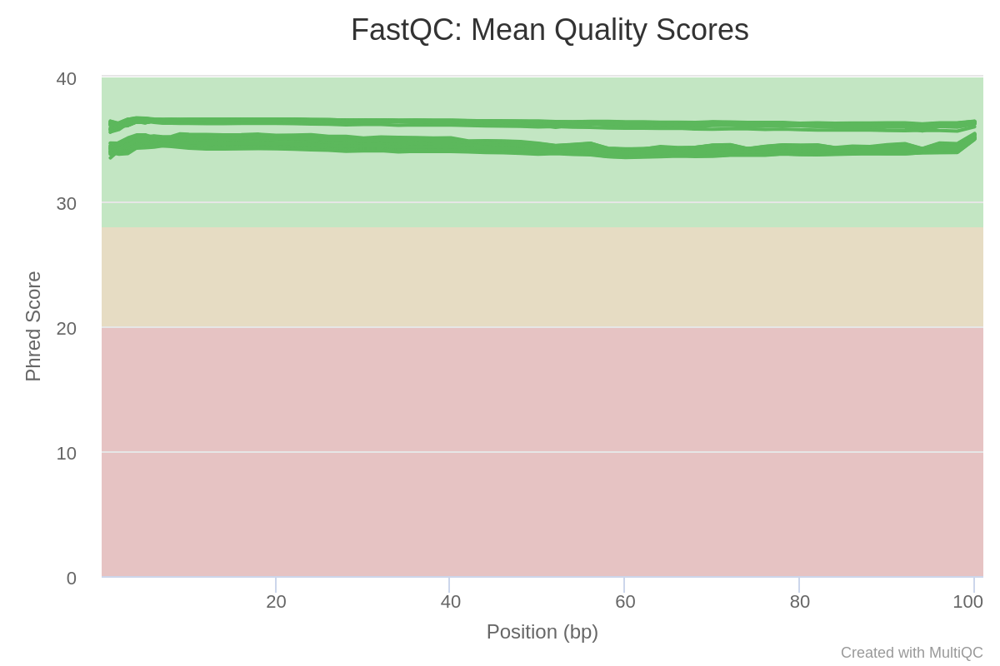
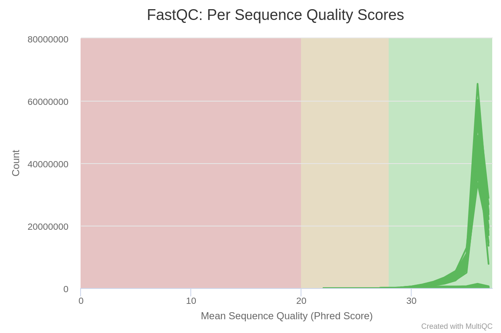
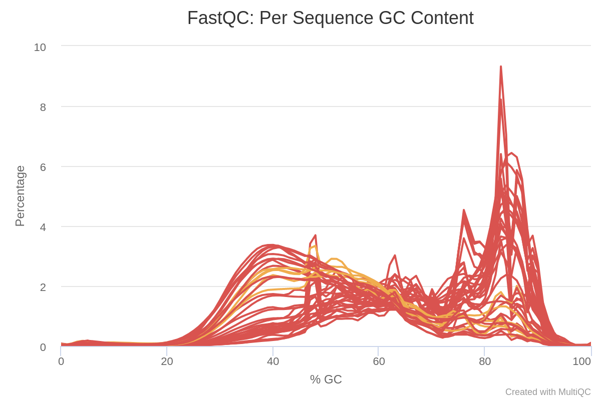
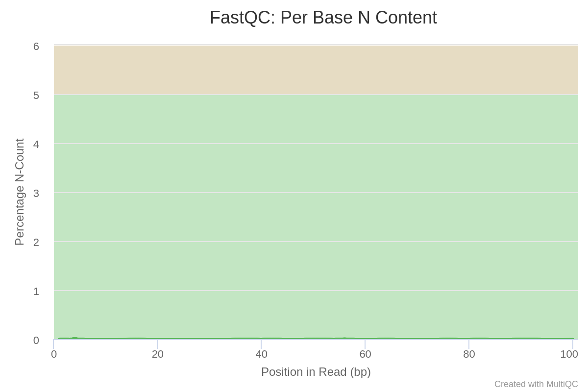
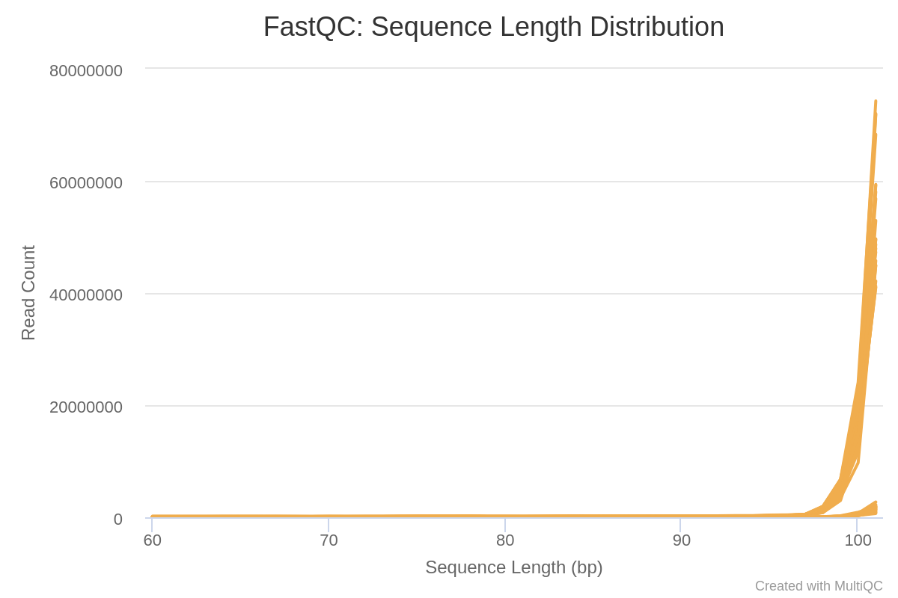
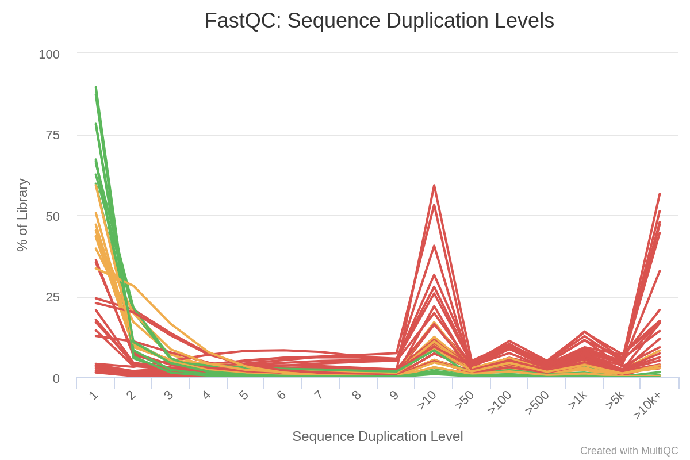
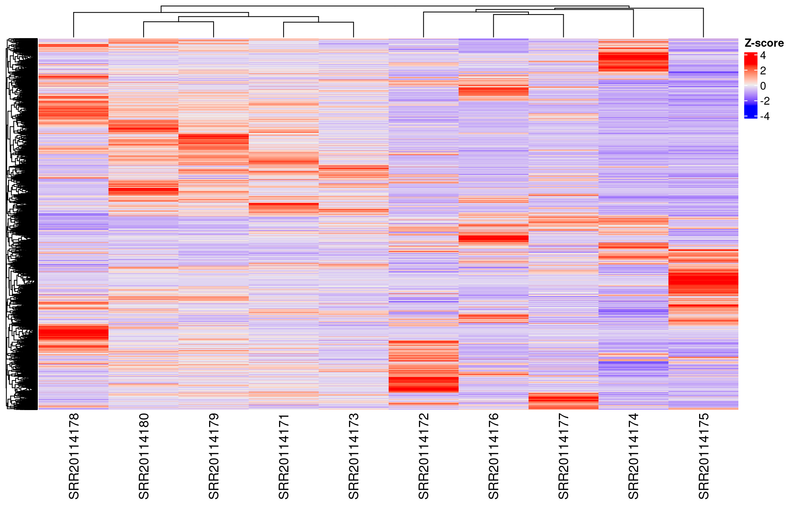

Este reporte, así como su versión en PDF y HTML, y todos los archivos usados para
su creación están disponibles en 
[GitHub](https://github.com/Bioinfo-Equipo/RNA-seq).


# Descripción de los datos

<table class="table table-bordered">
  <tbody>
    <tr>
      <td>Bioproject</td>
      <td>[PRJNA858106](https://www.ncbi.nlm.nih.gov/bioproject/PRJNA858106) </td>
    </tr>
    <tr>
      <td>Especie</td>
      <td>*Homo sapiens* </td>
    </tr>
    <tr>
      <td>Tipo de bibliotecas</td>
      <td>*Paired-end* </td>
    </tr>
    <tr>
      <td>Método de selección</td>
      <td>Ribo-zero</td>
    </tr>
    <tr>
      <td>Número de transcriptomas</td>
      <td>1 (Gencode v43)</td>
    </tr>
    <tr>
      <td>Número de réplicas biológicas</td>
      <td>10 (3 controles y 7 casos)</td>
    </tr>
    <tr>
      <td>Secuenciador</td>
      <td>Illumina NovaSeq 6000 (Homo sapiens)</td>
    </tr>
    <tr>
      <td>Distribución de las muestras  (SRA)</td>
      <td>SRR20114180 (Control-1), SRR20114179 (Control-2), SRR20114178 (Control-3), SRR20114177 (Patient-1), SRR20114176 (Patient-2), SRR20114175 (Patient-3), SRR20114174 (Patient-4), SRR20114173 (Patient-5), SRR20114172 (Patient-6) y SRR20114171 (Patient-7)</td>
    </tr>
    <tr>
      <td>Profundidad de secuenciación de cada transcriptoma</td>
      <td>.</td>
    </tr>
  </tbody>
</table>

# Resumen


# Métodos 

## Análisis de calidad de las lecturas y limpieza de adaptadores


### Análisis de  *raw data*

Para el análisis de calidad se usó fastqc de manera individual para cada data set
del SRA, y después se usó multiqc para visualizar en conjunto todos los resultados.


###  Limpieza de adaptadores

Para limpiar los adaptadores se usó el software trimmomatic en el siguiente 
bash script:

```
cd data
for i in *_1.fastq.gz;
do echo
trimmomatic PE -threads 8 -phred33 $i "${i%_1.fastq.gz}_2.fastq.gz" \
../data_trimmed/"${i%_1.fastq.gz}_1_trimmed.fastq.gz" ../data_trimmed/"${i%_1.fastq.gz}_1_unpaired.fastq.gz" \
../data_trimmed/"${i%_1.fastq.gz}_2_trimmed.fastq.gz" ../data_trimmed/"${i%_1.fastq.gz}_2_unpaired.fastq.gz" \
ILLUMINACLIP:../TruSeq3-PE.fa:2:30:10 LEADING:3 TRAILING:3 SLIDINGWINDOW:5:20 MINLEN:60
done
```

El script no es tan complicado, donde:

- ```./data``` es el directorio con todos los archivos crudos descargados de SRA.
- ```PE``` es para decir que el input sera un archivo paired end.
- ```phred33``` especifica la calidad de las bases.
- ```threads``` indica el número de núcleos que se van a utilizar.
- ```ILLUMINACLIP``` es para indicar los adaptadores y otras secuencias específicas de illumina.
- ```LEADING``` es para cortar las bases del comienzo de una lectura, si está por debajo de un umbral de calidad.
- ```TRAILING``` es para cortar las bases del final de una lectura, si está por debajo de un umbral de calidad.
- ```SLIDINGWINDOW``` recorta la lectura una vez que la calidad promedio dentro de la ventana cae por debajo de un umbral.
- ```MINLEN``` descarta la lectura si está por debajo de una longitud especificada.


### Analisis de calidad de las lecturas sin adaptadores

Se realizó el mismo procedimiento que con los datos crudos, pero ahora con las
lecturas sin adaptadores.


## Mapeo con el transcriptoma de referencia

Descargamos el transcriptoma de referencia en el directorio donde 
se correra kallisto, *i. e.*, en 
```/mnt/Timina/bioinfoII/rnaseq/BioProject_2023/rawData/COVID_virus``` con wget:

```
wget https://ftp.ebi.ac.uk/pub/databases/gencode/Gencode_human/release_43/gencode.v43.transcripts.fa.gz
```

Después, generamos el index de Kallisto con
```
kallisto index -i ./kallisto_quant/Hs_ref.kidx gencode.v43.transcripts.fa.gz
```

Posteriormente, se crearon directorios individuales para cada muestra dentro de 
```./kallisto_quant/```, ya que kallisto solo trabaja individualmente con cada
par de lecturas.

El pseudoalineamiento y cuantificacióncon kallisto se realizó para cada muestra con la siguiente
estructura:

```
kallisto quant -i ./kallisto_quant/Hs_ref.kidx -o ./kallisto_quant/SRR20114171 -t 25 ./data_trimmed/SRR20114171_1_trimmed.fastq.gz ./data_trimmed/SRR20114171_2_trimmed.fastq.gz
```

Donde ```-i``` indica el índice, ```-o``` el directorio de salida, ```-t```
el número de núcleos a usar y los otros dos archivos son el par de reads.

El output de kallisto son tres archivos: un json llamado ```un_info.json```,
un archivo de texto con las estimaciones de la abundancia llamado
```abundance.tsv``` y un archivo binario con información de la corrida, estimación
de la abundancia, estimados de bootstrap y longitud de los transcritos llamado
```abundance.h5 ```.


## Expresión diferencial

### Importación de los datos de kallisto

```{r libraries, include=FALSE, warning=FALSE, message=FALSE}
library(tximport)
library(tidyverse)
library(DESeq2)
library(ggplot2)
library(ggrepel) # libreria que evita el overlap de texto en labels
library(rhdf5)
library(GenomicFeatures)
library(dplyr)
library(biomaRt)
library(gprofiler2)
library(ComplexHeatmap)
library(genefilter)
library(clusterProfiler)
library(AnnotationDbi)
library(org.Hs.eg.db)
```


El primer paso para hacer en análisis de expresión diferencial fue importar los
datos de la cuantificación de kallisto. Para eso, antes hay que crear una tabla
```tx2gene```, que mapea genes con transcritos.

```{r tx2gene, warning=FALSE, message = FALSE}
ensembl = useEnsembl(biomart="ensembl", dataset="hsapiens_gene_ensembl")


tx2gene = getBM(attributes=c('ensembl_transcript_id','ensembl_gene_id'), 
                   mart = ensembl) %>% relocate(ensembl_transcript_id)
tx2gename = getBM(attributes=c('ensembl_transcript_id', 'hgnc_symbol'), mart = ensembl)
```

Alternativamente, podríamos crear el archivo tx2gene a partir de un archivo de anotación
GTF/GFF3 con el siguiente código, pero implicaría descargar el archivo y es un
poco más pesado.

```
## Creación del archivo tx2gene a partir de los archivos de anotación 
txdb = makeTxDbFromGFF(file = "annotation.gtf.gz")
saveDb(x = txdb, file = "annotation.gtf.gz") 
k = keys(txdb, keytype = "TXNAME")
tx2gene = select(txdb, k, "GENEID", "TXNAME")
```


Ahora, ya podemos importar la información de kallisto:

```{r kallisto-import, message=FALSE}
## Guardado en una variable de los paths hacia los archivos h5
files = file.path(list.dirs("./kallisto_quant", recursive = FALSE),
                  "abundance.h5")
names(files) = str_extract(files, "SRR\\d+")

## Importación de la información
txi.kallisto.tsv = tximport(files, type = "kallisto", tx2gene = tx2gene,
                            ignoreAfterBar = TRUE, ignoreTxVersion=TRUE)

## Conteos de los primeros transcritos
head(txi.kallisto.tsv$counts)
```

Ahora, hay que crear un objeto tipo data set de DESeq2, llamado DESeqDataSet.
DESeq2 necesita saber el tratamiento caso/control de cada muestra. Para saber eso,
descargamos la tabla de metadatos disponibles en 
[SRA Run Selector](https://www.ncbi.nlm.nih.gov/Traces/study/?acc=PRJNA858106&o=acc_s%3Aa),
con el nombre de ```metadata.csv```.


```{r dds-creation, warning=FALSE, message=FALSE}
## Importación de metadatos a R
meta = read.csv("./downloads/metadata.csv", header = TRUE)
samples = column_to_rownames(meta, var = "Run")

## Creación del objeto DESeqDataSet
dds = DESeqDataSetFromTximport(txi.kallisto.tsv,
                               colData = samples,
                               design = ~disease_state)
```


## Análisis exploratorio

Primero, hay que pre-filtrar los conteos bajos, con el siguiente código:

```{r pre-filtering, message=FALSE, warning=FALSE}
## Pre-filtering
keep = rowSums(counts(dds)) >= 10
dds = dds[keep, ]

## Factor level
dds$disease_state = factor(dds$disease_state, levels = c("normal", "Covid-19"))
```

Para poder identificar algún *batch effect* se graficó un PCA, que se muestra en
la sección de resultados. Antes de relizar esa visualización, se normalizó
el objeto ```dds``` con la *variance stabilizing transformation*:

```{r variance-stabilizing-transformation, message=FALSE}
vst = vst(dds, blind = FALSE)
```


## Análisis de expresión diferencial

Una vez que vimos que no habían anomalías en el dataset, hicimos el análisis.
Para correr el análisis de expresión diferencial, se usa la siguiente función:

```{r DESeq, message=FALSE}
dds = DESeq(dds)
```


Los resultados del modelo son los siguientes, con un nivel de significancia de 
$\alpha=0.01$:

```{r res}
(res = results(dds, alpha = 0.01))

## Significative genes
resSig = subset(res, padj < 0.01)
```


## Gene Ontology Enrichment

Para el enriquecimiento de los términos GO, se descargó la librería 
```org.Hs.eg.db``` que tiene la base de datos de humanos. El código usado es el
siguiente. Solo se tomó en cuenta la ontología correspondiente al proceso biológico
(BP). El código usado fue el siguiente


```{r GO}
genes = rownames(resSig[resSig$log2FoldChange >= 1, ])

GO = enrichGO(gene = genes, OrgDb = org.Hs.eg.db, keyType = "ENSEMBL", ont = "BP")

G = as.data.frame(GO)
head(G)
```


# Resultados


## Análisis de calidad de datos crudos

Haremos énfasis en la calidad de las *reads* sin adaptadores.
Todo el resumen de la calidad de los datos crudos se encuentra [aquí](QC/QC_rawData/multiqc_report.html). 


Todos los resultados se encuentran dentro del DNA HPCC en la ruta siguiente ruta:
```
/mnt/Timina/bioinfoII/rnaseq/BioProject_2023/rawData/COVID_virus/FastQC_rawData
```

En general, la calidad de las lecturas crudas fue bastante buena, por lo que
pudimos continuar con el pipeline.


## Análisis de calidad de los datos sin adaptadores


Como podemos ver en la siguiente gráfica, la calidad media de cada base de
las reads es en general buena.




También podemos ver que la calidad media de las *reads* igualmente es buena.



El contenido de GC es complicado, pero como estamos analizando datos de 
transcripción, toleraremos que hayan varios picos y distribuciones no normales.




La calidad de secuenciación es de un nivel tal que la existencia lecturas N 
es casi nula.





La longitud de las secuencias si bien no es perfecta, es aceptable. Además, 
son secuencias largas, por lo que el alineamiento será mejor.




En cuanto a lecturas duplicadas, hay muchas que se repiten; lo cual tiene sentido,
ya que estamos anlizando datos de transcripción.



Todos los resultados, tanto individuales de cada fastqc como del multiqc, se encuentran
dentro del DNA HPCC en la ruta:
```
/mnt/Timina/bioinfoII/rnaseq/BioProject_2023/rawData/COVID_virus/FastQC_trimmed
```


## Análisis exploratorio

### PCA

Una manera estándar para hacer el análisis exploratorio de los datos es graficar
un PCA.

```{r PCA, echo=FALSE}
plotPCA(vst, intgroup = "disease_state")
```

Como podemos observar, no hay nada que nos haga pensar en algún batch effect.
En su defecto, vemos como una muestra es un outlier. Para identificarla, 
imprimimos la lista de los dos primeros componentes principales.


```{r PC, echo=FALSE}
PC = plotPCA(vst, intgroup = "disease_state", returnData = T)
PC[, c(1,2)]
```

Como se muestra, el outlier es la muestra SRR20114175.


## Expresión diferencial


### Extracción de los genes sobreexpresados e infraexpresados

Una vez que tenemos los *p*-valores para todos los genes, solo nos interesan los
más significativos. Extraemos los más expresados durante
el caso y los menos expresados, en dos archivos respectivamente: ```UP_genes.tsv```
y ```DOWN_genes.tsv```.

```{r resSig-extract}

## Up genes
resSigUP = subset(resSig, log2FoldChange >= 1)
resSigUP = cbind(rownames(resSigUP), resSigUP) # Converts rownames into first column
colnames(resSigUP)[1] = "GENE_ID" # Adds name to first column

write.table(resSigUP, file = "./DEG_results/UP_genes.tsv", quote = FALSE,
            sep = "\t",row.names = FALSE)


## Down genes
resSigDOWN = subset(resSig, log2FoldChange <= -1)
resSigDOWN = cbind(rownames(resSigDOWN), resSigDOWN)
colnames(resSigDOWN)[1] = "GENE_ID"

write.table(resSigDOWN, file = "./DEG_results/DOWN_genes.tsv", quote = FALSE,
            sep = "\t",row.names = FALSE)
```

Ambos archivos se encuentran en el DNA HPCC en el siguiente directorio:

```
/mnt/Timina/bioinfoII/rnaseq/BioProject_2023/rawData/COVID_virus/DEG_results
```


### MA plot


```{r MA-plot, echo=FALSE}
plotMA(res, main= "MA plot")
```


```{r MA-plot-shrinkm, message=FALSE}
resAsh = lfcShrink(dds, coef=2, type="ashr")
plotMA(resAsh, ylim = c(-6,6), main="MA plot con ashr LFC shrinkage")

```


```{r MA-plot-sig, echo=FALSE}
plotMA(resSig, main = "MA plot solo con resultados significativos")
```


### Volcano plot


```{r volcano, warning=FALSE, echo=FALSE}

de = as.data.frame(res)

de$diffexpressed = "NO"

de$diffexpressed[de$log2FoldChange > 0.6 & de$pvalue < 0.01] <- "UP"

de$diffexpressed[de$log2FoldChange < -0.6 & de$pvalue < 0.01] <- "DOWN"


ggplot(data = de, aes(x=log2FoldChange, y=-log10(pvalue), col=diffexpressed)) + 
  geom_point() 
  
```


### Gene clustering

Una vez que hemos realizado en análisis de expresión diferencial, podemos graficar
un heatmap con TODOS los genes, como se muestra a continuación:



Sin embargo, al tener todos los genes graficados, hay mucho ruido y es difícil
de interpretar la visualizar. Sin embargo, podemos apreciar como la muestra 
SRR20114175 es la más diferente de todas y la última en unirse al dendograma.
Es el mismo outlier que identificamos en el PCA.


Ahora, podemos visualizar el heatmap solamente con los genes que consideramos
significativos; *i. e.*, que tienen un *p*-valor ajustado menor a 0.01 y un LFC 
mayor a 1 o menor a -1.

```{r heatmap-sig, echo=FALSE}
resSig.df = as.data.frame(resSig)

mat = counts(dds, normalized = TRUE)[rownames(resSig.df), ]

mat.z = t(apply(mat, 1, scale))
colnames(mat.z) = colnames(dds)

rownames(mat.z) = NULL

Heatmap(mat.z, cluster_columns = T, cluster_rows = T, name = "Z-score")
```

Como se puede apreciar, las muestras de control (SRR20114178, SRR20114179 y
SRR20114180) forman su propio clúster más rápido. Además, la diferencia entre
ambos tratamientos es más visible. Una vez más, observamos como la muestra 
SRR20114175 difiere del resto en un clúster de genes.


Finalmente, podemos tener otra forma de visualizar usando los genes más expresados:


```{r heatmap-top, echo=FALSE}
### Failed attempt with most variable genes
# topVarGenes = head(order(rowVars(assay(vst)), decreasing = TRUE), 20)
# mat2 = assay(vst)[topVarGenes, ]
# mat2 = mat2 - rowMeans(mat2)
# anno = as.data.frame(colData(vst)[, "disease_state"])
# pheatmap(mat2, annotation_col = anno)


select = order(rowMeans(counts(dds ,normalized=TRUE)),
                decreasing=TRUE)[1:20]
df = as.data.frame(colData(dds)[,c("disease_state")])

#heatmap
pheatmap(assay(vst)[select,], show_rownames = FALSE, annotation_col = df)
```

Podemos ver que, una vez más, las muestras de control se agrupan entre sí

Otra forma de visualizar es usando los genes que tienen una mayor varianza.

```{r heatmap-var, echo=FALSE}
topVarGenes = head(order(rowVars(assay(vst)), decreasing = TRUE), 20)
mat2 = assay(vst)[topVarGenes, ]
mat2 = mat2 - rowMeans(mat2)
anno2 = as.data.frame(colData(vst)[, "disease_state"])
pheatmap(mat2, annotation_col = anno2, show_rownames = F)
```

En este caso, interesantemente, el clustering entre muestras es distinto.

# Discusión


