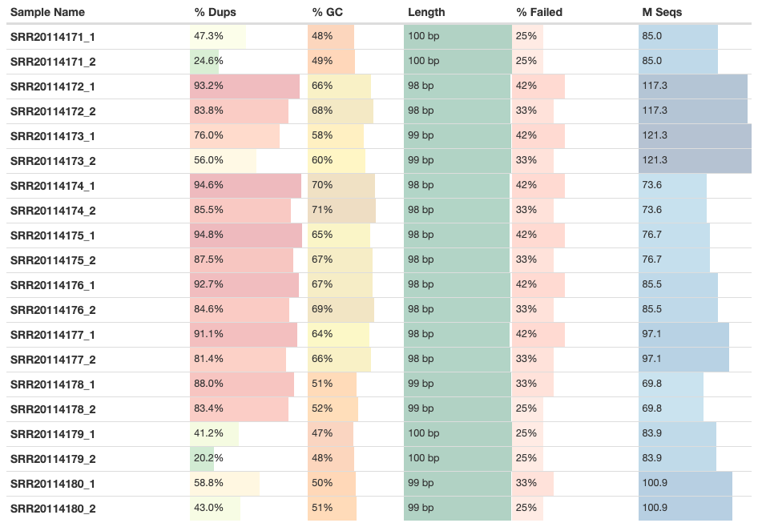
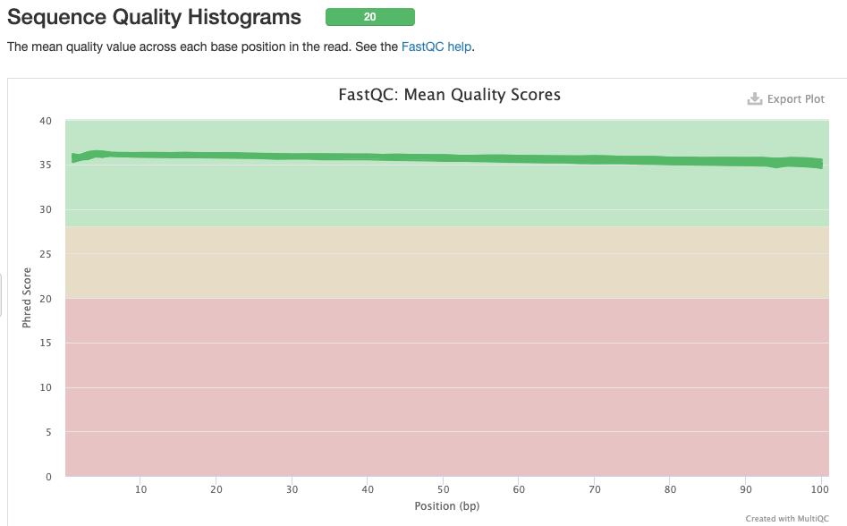
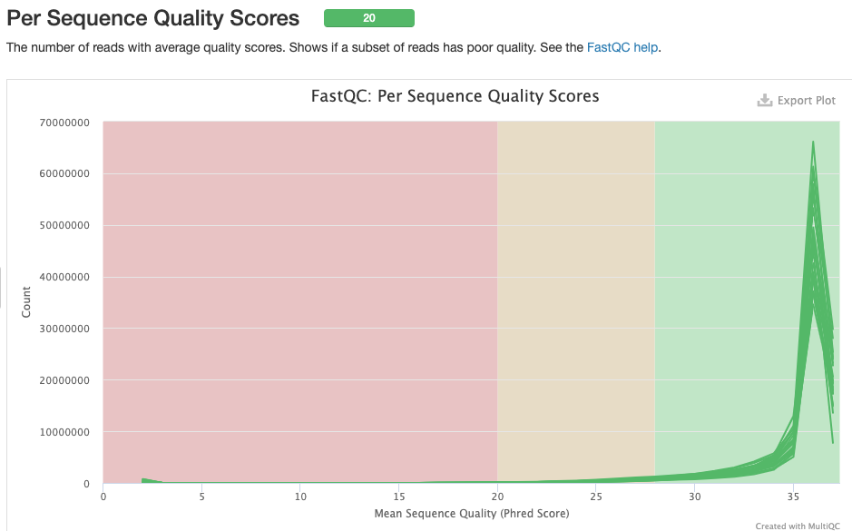
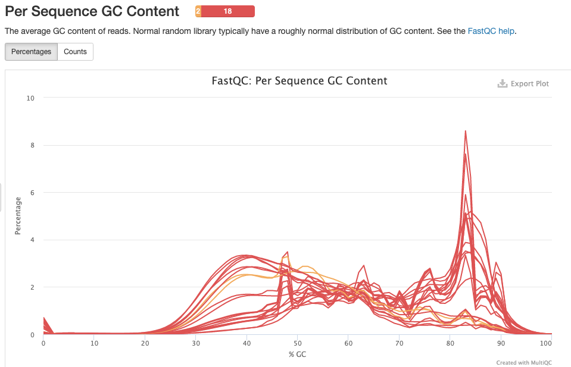
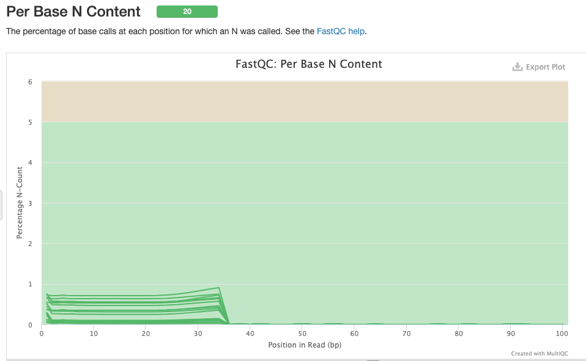
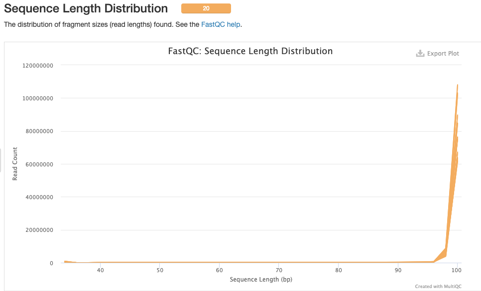
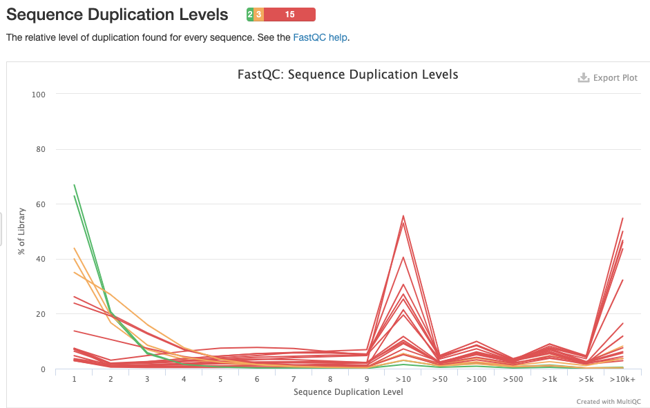
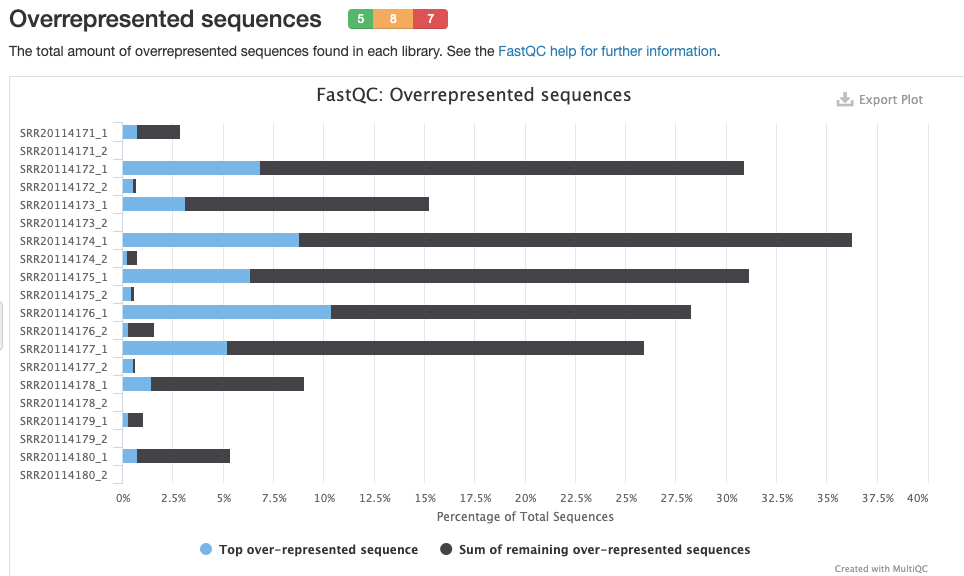
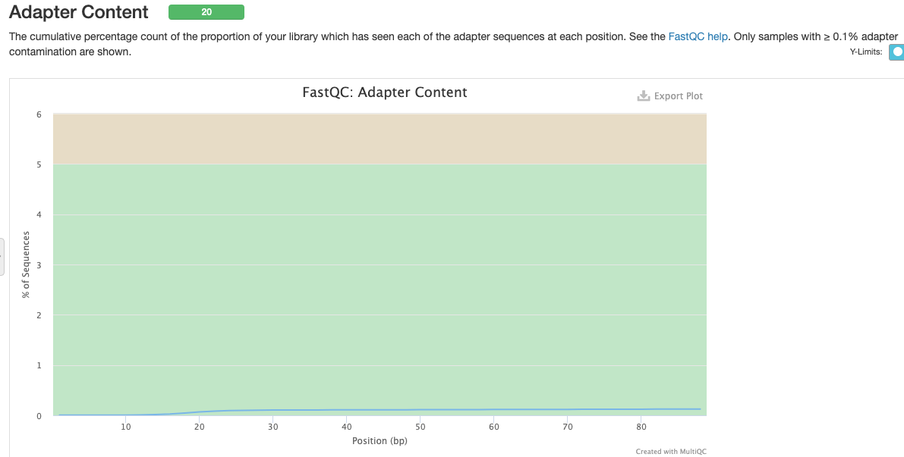

# Data description

<table class="table table-hover">
  <tbody>
  </tr>
    <tr class="table-light">
      <th scope="row">Bioproject</th>
      <td>
PRJNA858106
</td>
  </tr>
   </tr>
    <tr class="table-light">
      <th scope="row">Species</th>
      <td>
Human
</td>
  </tr>
  </tr>
    <tr class="table-light">
      <th scope="row">Libraries type</th>
      <td>
Paired-end
</td>
  </tr>
  </tr>
    <tr class="table-light">
      <th scope="row">Selection method</th>
      <td>
?
</td>
  </tr>
  </tr>
    <tr class="table-light">
      <th scope="row">Number of transcriptomes</th>
      <td>
10
</td>
  </tr>
  </tr>
    <tr class="table-light">
      <th scope="row">Number of biological replicates</th>
      <td>
?
</td>
  </tr>
  </tr>
    <tr class="table-light">
      <th scope="row">Sequencer</th>
      <td>
ILLUMINA (Illumina NovaSeq 6000)
</td>
  </tr>
  </tr>
    <tr class="table-light">
      <th scope="row">Sample distribution (control and treatment)</th>
      <td>
?
</td>
  </tr>
  </tr>
    <tr class="table-light">
      <th scope="row">Sequencing depth of each transcriptome</th>
      <td>
?
</td>
  </tr>
  </tbody>
</table>

# Abstract

# Results and discussion
## Quality analysis of the readings and cleaning of adapters

### General Statistics

### FastQC

## Assembly with the reference transcriptome (kallisto)
## Differential expression with DESeq2
## Analysis of GO terms
# Visualization